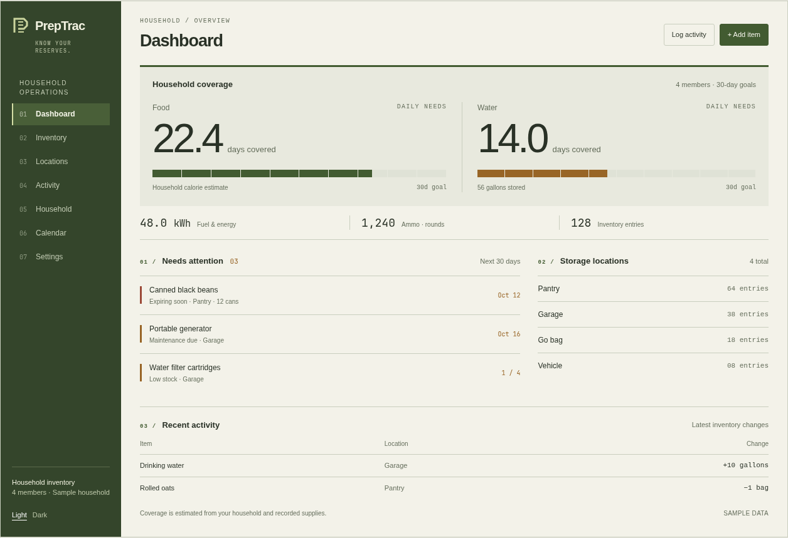
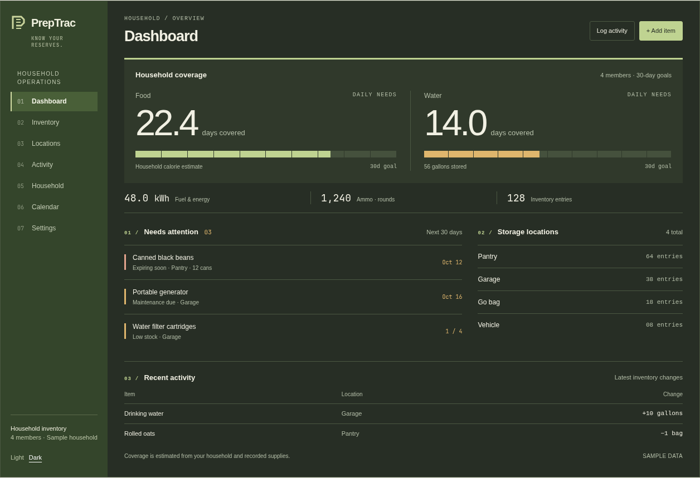

# PrepTrac visual overhaul: Readiness index

Date: 2026-10-02

Status: Approved for implementation by user request on 2026-10-02; implemented for v0.3.0.

## Intent and agreed direction

PrepTrac should serve both households preparing for ordinary disruptions and dedicated preppers managing substantial supplies. It should feel like a credible, modern preparedness inventory tool: practical, precise, and approachable, with a clear identity of its own.

The user selected **B — Readiness index** from the interactive dashboard mockups. The defining elements are solid olive navigation, a new stacked-supply P mark, warm neutral surfaces, large coverage figures, and segmented goal scales. A full dark theme is required. Desktop is the primary use case; smaller screens must remain usable.

The user authorized layout changes across the existing application while retaining familiar navigation and existing functionality. The dashboard priorities, in order, are:

1. How long the household can get by.
2. What needs attention.
3. What supplies exist and where they are stored.

No production UI changes have been made during design exploration.

## Selected visual reference

These are design mockups with illustrative sample data, not production screenshots. The specification below resolves details that the mockups simplify, including actual goal units, optional household data, navigation controls, and status semantics.

Light theme:

Dark theme:

## Brand and visual system

- Replace the blue calendar logo with the selected angular P formed from stacked supply levels. Create the mark as a local SVG, with a solid, legible silhouette at small sizes. Use the same geometry for sidebar, mobile header, favicon, and installable-app icons. Keep the PrepTrac name.
- Use the mockup's straightforward sans-serif typography. The existing Inter font can provide consistent production typography without adding a font dependency. Use tabular numbers for quantities and a system monospace only for small indices, dates, and measurement labels.
- Increase small sample-label sizes from the mockup where needed for production readability: approximately 14px for ordinary interface text, 12px for supporting information, and 28–32px page headings. Coverage figures may be 52–64px on desktop.
- Light palette: warm paper `#f3f2e9`, quiet surface `#e8e9de`, graphite text `#293126`, olive action `#425b31`, and olive sidebar `#34452b`.
- Dark palette: opaque olive-charcoal paper `#272e25`, surface `#30392b`, warm text `#f1f0e3`, clear separators `#4b5842`, and lighter olive accents `#bfd391`. Dark-theme primary buttons use dark text on light olive.
- Amber and muted rust communicate specific caution and destructive states. Their text, backgrounds, and focus colors must pass contrast checks. Color alone must never communicate status.
- Use open layouts, horizontal rules, aligned rows, and restrained typography for hierarchy. Small 3–4px corner radii belong on controls and genuine overlays. Calendar cells, tables, coverage scales, and navigation remain mostly square. Shadows are reserved for actual elevation, such as dialogs and popovers.
- Use solid fills rather than gradients, transparency, glows, texture, camouflage, distressed lettering, or survivalist imagery. Keep icons when they identify an action or support collapsed navigation; remove decorative page-heading and metric icons.
- Preserve user-defined category colors as small labeled swatches or data-series accents. Do not recolor saved categories or force all category data into olive.

These colors are the visual target; adjust token values as necessary to meet accessibility requirements while preserving the selected character.

## Application shell and navigation

Keep Dashboard, Inventory, Locations, Activity, Household, Calendar, and Settings in their existing order and at their existing URLs. Preserve the sidebar collapse control, notification bell, keyboard navigation, mobile drawer, and skip-to-content link.

Use a solid olive sidebar in both themes. The active page has a strong, quiet rectangular treatment and a clear edge indicator. Sparse navigation icons are functional in the collapsed rail; section numbers from the mockup are optional display details, never a substitute for labels or icons. Keep notification and theme controls clearly visible at the bottom of the sidebar.

Page headers align the page name and essential local actions. Use content widths appropriate to the task: wider inventory and calendar, narrower editing and settings content. Do not impose one identical boxed layout on every page. Use actual household information when available; never hardcode the mockup's four-person household or invented storage counts.

Retain existing theme persistence and system-preference support through next-themes. Both themes must cover loading, empty, error, hover, focus, selection, charts, dialogs, notifications, and demo states.

## Dashboard composition and behavior

### Household coverage

Lead with the selected rectangular coverage band. Food and water appear side by side, with large days-covered figures, their basis, and user-goal progress when an applicable goal exists. Keep a short explanation that coverage is estimated from recorded supplies and household needs.

Reuse `dashboard.getStats`, existing household information, and existing settings goals. Do not change calorie, water, fuel, or category calculations. Food's fallback estimate must remain explicitly labeled when a household-based calculation is unavailable. For water, show the existing gallons quantity and a setup prompt when days cannot be calculated; an unavailable estimate must not become a fabricated zero-day estimate.

The mockup's shared 30-day goal is illustrative. Production food goals remain in days and water goals remain in gallons. Water coverage can lead in days while its progress scale is labeled, for example, `56 / 120 gallons`. Display actual values and units together. No implicit 30-day target and no new water-days setting are introduced.

Preserve access to metric breakdowns and alternate fuel/energy units. The large coverage quantities have explicit labels; alternate measurements and breakdown controls remain keyboard and touch accessible. Clamp the visual fill at 100%, retain actual values above the target, and omit progress percentages when no valid goal exists.

Below coverage, show a compact row of fuel/energy, ammunition, and inventory totals. These must remain readable but visually secondary to food and water.

### Needs attention

Place a compact, date-oriented attention list below the coverage region, beside the smaller storage-location summary on desktop. Show meaningful item names, status text, due dates or quantities, and location information when the existing response supplies it.

Build supply checks from existing dashboard expiration and maintenance data, the existing filtered low-inventory query, and upcoming events. Reuse the existing policies in `src/utils/inventory.ts`: expiring soon means the next 30 days; low inventory means a positive explicit threshold with quantity at or below that threshold; maintenance uses its recorded schedule. Do not create arbitrary minimum quantities or new alert thresholds.

Merge duplicate item/type records from item checks and calendar events. Dated rows sort by due date, with already-due maintenance first; undated low-inventory rows follow. The compact overview shows at most six rows and links to Inventory and Calendar for deeper review. Counts describe returned records and must not imply that capped API responses cover all outstanding work.

Keep notification preferences and the notification bell independent: disabling notifications does not remove ordinary supply checks from the dashboard, and the redesign does not enable notifications or deliveries. Empty copy says there are no checks in the displayed window, rather than claiming complete preparedness.

### Inventory context and secondary detail

Show a compact list of actual storage locations linking to the existing Locations page. Location entry counts in the mockup are illustrative; omit them because the current locations response does not include counts, rather than fetching the complete inventory merely to produce decorative totals.

Keep existing category goal detail available as an open table or list below the attention region. Preserve custom category targets and fuel sub-goals. Keep recent activity below it with existing filters, pagination, row-count controls, and access to the full Activity page.

Empty inventory uses an ordered setup checklist: household, supplies and storage, then goals. This guides the real initial setup without three decorative feature cards.

## Other product pages

### Inventory and Locations

Retain the table-first default and the existing card alternative. Use an unrounded ledger-style table with clear columns, aligned quantities and units, readable dates, and textual status indicators. Preserve edit/delete actions, confirmations, exports, QR functionality, search debounce, filtering, and location selection.

Bring search, category, location, status filters, and the view selector into a coherent compact toolbar, allowing wrapping at smaller widths. Do not remove the additional filter options. The card view remains a genuine alternative for items that benefit from contained grouping; remove generic shadows and arbitrary hover movement.

Locations presents the active storage location, its description, its inventory table, and its activity history. Use the same table and controls as Inventory, retaining the existing location-selection behavior and location-prefilled add form.

### Activity

Present addition/consumption as a clearly labeled control above aligned item-entry rows. Keep batch input, notes, validation, success/error feedback, analytics controls, and history pagination. Charts use legible theme-aware axes, grids, legends, and opaque tooltips; preserve meaningful category/item differentiation rather than recoloring every series identically.

### Household

Lead with the household needs summary that explains food and water estimates. Organize activity-level choices and members as readable rows and ordinary form controls. Preserve imperial/metric preferences, every member field, all conversions, editing, deletion confirmations, and existing calculations.

### Calendar

Keep the month grid, month controls, event labels, event details, and the existing legend. A calendar naturally uses cells and dividers; it does not need an extra rounded outer card. Use semantic status colors and text labels consistently with upcoming-event lists. Preserve all event interactions and types.

### Settings and supporting surfaces

Retain settings tabs, their URLs/search parameters, keyboard behavior, and all panels. Style them as an open settings workspace with restrained rules and grouped fields. Destructive sample-data actions remain explicit and distinct from ordinary settings actions.

Apply the same identity to forms, confirmation dialogs, notification panels, footer, demo banner, loading states, errors, not-found pages, and Import/Consume redirects. Dialogs retain opaque surfaces, appropriate elevation, Escape handling, focus management, visible labels, and inline validation. Existing demo-mode controls and server-side write restrictions remain intact.

## Frontend implementation boundaries

Use existing React, Tailwind, CSS, next-themes, Lucide, and Recharts capabilities. No new dependency is required. Define a small semantic palette and deliberate reusable CSS classes in `src/styles/globals.css` for controls, page structure, tables, and status treatments. Replace touched hardcoded utility colors; avoid broad overrides of all Tailwind grays or global styles that accidentally recolor user category data.

Retain existing behavior-based components. A small brand-mark component is useful because the same mark appears in multiple shell states. A separate attention-list component is appropriate because merging, sorting, and rendering real checks is one responsibility. Do not introduce generic marketing-section wrappers or duplicate entire pages to support dark mode.

Expected areas: `src/app/layout.tsx`, page files, `src/components/`, `src/styles/globals.css`, chart/event style helpers, and `public/` identity assets and manifest. Reuse existing API response types and queries. Keep new client-side derivations small and testable. Preserve query invalidation and loading/error feedback.

No schema changes, migrations, API contract changes, notification-delivery changes, deployment, or data backfills are part of this overhaul. Public routes, import/export formats, units, and stored user settings remain compatible.

## Verification and acceptance

The implementation must:

- Match the selected B identity in both themes, with food/water coverage first, attention second, and inventory/storage third.
- Show real values, goals, and household assumptions; cover missing household data, absent goals, zero quantities, above-target supplies, empty inventories, and long item/location names.
- Preserve all existing actions, read-only demo restrictions, forms, filters, exports/imports, charts, QR display, notifications, and navigation.
- Remain usable at desktop widths of 1024–1920px and at mobile widths down to 320px, with narrow layouts stacking coverage and reflowing toolbars. Contain any necessary inventory-table horizontal scroll locally.
- Pass keyboard checks for sidebar/drawer, settings tabs, theme control, metric details, filters, and dialogs. Meet WCAG AA text contrast and retain visible focus and non-color status labels.
- Pass repository lint, TypeScript checking, applicable Vitest tests, a production build, and existing Playwright smoke/accessibility checks. Add meaningful focused tests for attention-list derivation and coverage edge states where behavior changes; do not add tests that merely restate styling.
- Be visually reviewed in both themes across Dashboard, Inventory, Locations, Activity, Household, Calendar, Settings, and representative overlays.

All browser workflows must use a separate disposable local database with synthetic data. Do not seed, reset, or run mutation tests against the user's existing database. Any temporary settings or sample-data actions must remain in that isolated test environment.

## Assumptions and limits

The user approved the B visual direction, the app-wide layout scope, familiar navigation, a new identity, desktop priority, and dark-mode availability. The user subsequently authorized implementation of this document and requested a v0.3.0 release commit.

The visual study's sample counts, dates, and shared 30-day targets are not product defaults. Production data and current policies take precedence.

PrepTrac retains its documented single-user deployment model without built-in authentication. This design work does not change its access model or make public exposure safe.

The comparison previews passed theme/selection controls and layout-overflow checks at 320, 390, 768, 1024, and 1440px. Those checks validate the mockups only; production verification remains required after implementation.
